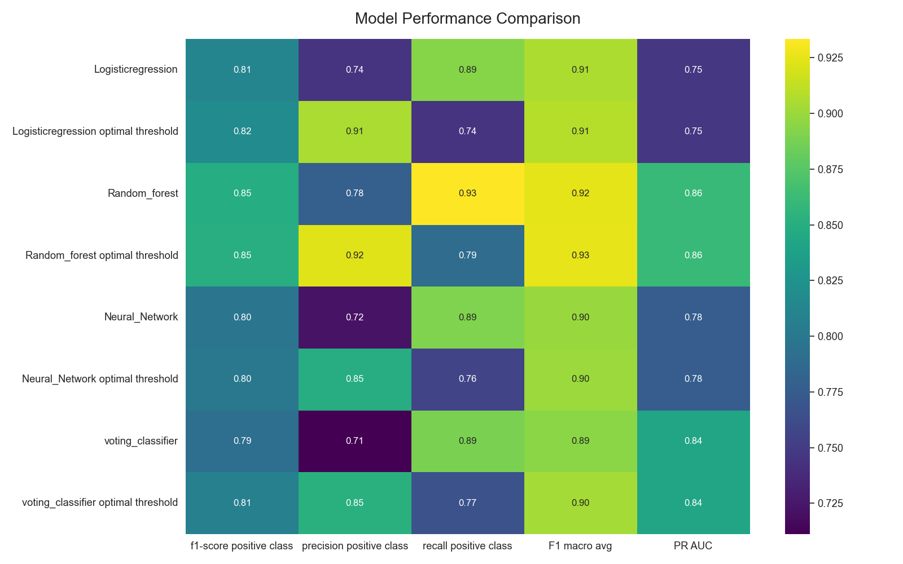
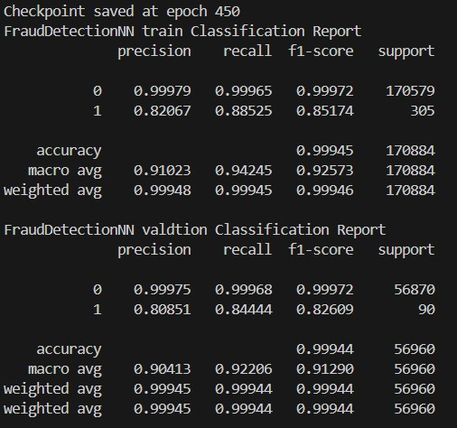
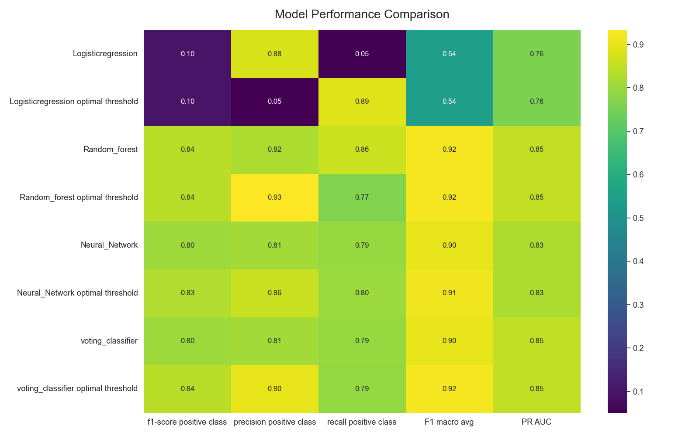

#  Credit Card Fraud Detection 

This project builds a robust system to **detect fraudulent credit card transactions** using classical machine learning models and a deep learning model with **Focal Loss** and using a dataset from Kaggle, which includes  284,807 credit card transactions with only 492 frauds, **is highly** unbalanced. It includes complete workflows for data processing, model training, evaluation, and reporting.
achieving an F1-score of 0.85 and 0.85 PR_AUC for the positive class (fraud).

---

## Project Structure

```
CREDIT-CARD-FRAUD-DETECTION/
├── config/                     # Configuration YAMLs
│   ├── data.yml
│   └── trainer.yml
├── data/                       # Input CSV files
│   ├── train.csv
│   ├── val.csv
│   ├── test.csv
│   └── trainval.csv
├── models/                     # Saved models and evaluation results
│   ├── <timestamped folders>/
│   └── focal_loss_checkpointsfocal_last/
├── credit_fraud_train.py       # Training for classical ML models
├── Focal_loss.py               # Training PyTorch model with Focal Loss
├── test_script.py              # Evaluation on test set
├── credit_fraud_utils_data.py  # Data loading, scaling, balancing
├── credit_fraud_utils_eval.py  # Evaluation metrics and plots
├── help.py                     # Helper functions (config/model IO)
├── EDA.ipynb                   # Exploratory Data Analysis notebook
└── README.md                   # 📄 You are here
```

---

## Models Used

- **Logistic Regression**
- **Random Forest**
- **K-Nearest Neighbors**
- **Neural Network (MLPClassifier)**
- **Voting Classifier (Ensemble)**
- **Custom Neural Network with Focal Loss (PyTorch)**

---

## Configuration Files

- `config/data.yml` – Paths, balancing, scaling
- `config/trainer.yml` – Training settings for each model, evaluation config

---

## How to Run

### 1. Install Dependencies
```bash
pip install -r requirements.txt
```

> Includes `scikit-learn`, `pandas`, `matplotlib`, `seaborn`, `torch`, `mlxtend`

---

### 2. Train Models (Classical ML)
```bash
python credit_fraud_train.py --data data.yml --trainer trainer.yml
```

---

### 3. Train Deep Model (Focal Loss)
```bash
python Focal_loss.py
```

---

### 4. Evaluate on Test Set
```bash
python test_script.py
```

---

## Evaluation Outputs

Each trained model is saved in `models/<timestamp>/` with:

- Classification Reports
- Confusion Matrix Heatmaps
- Precision-Recall Curves
- Threshold-based tuning results
- Voting classifier ensemble (if enabled)
- PR-AUC metrics

## Results



Note:

- The optimal threshold calculated by finding highest F1-score and it's threshold **in training data only**.

---

## Focal Loss Model (PyTorch)

Trained via custom architecture with:

```python
BatchNorm → Tanh → Dropout → Focal Loss
```

Designed to handle extreme class imbalance with tunable `alpha` and `gamma`.

#### Focal-loss results 

* I tried Server combination of Alpha (0.80-0.99, +0.5) and gamma (0-4, +1).

* The best result archieve by Alpha 0.75 and gamma 2.

    


* Notes:
  * Alpth and gamma sometimes unstables train using batchnorm make this effect less occur and switching from Adam to SGD also. 
  * High gamma (5~7) gives very noisey loss curve.

---

## Class Imbalance Handling

Supports multiple techniques:
- Class Weights (for LR, RF)
- Oversampling (`do_balance`)
- Focal Loss (for PyTorch NN)

---

#### Smote and undersampling technique 

* SMOTE (Synthetic Minority Over-sampling Technique) is an oversampling method used to generate synthetic samples for the minority class. Despite experimenting with SMOTE, random over-sampling, and under-sampling techniques, the results on the validation data were poor.

* Smote (0.05-ratio) results:
 
* RandomUnderSampler (0.05-ratio) results:
 

---


